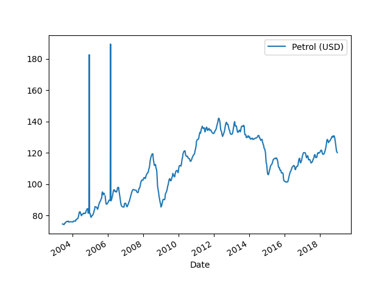

# Petrol Price Prediction with LSTM 
==============================
                                                                    
This is a machine learning model that predicts petrol prices using univariate timeseries data and LSTM (Long Short-Term Memory) neural networks. The model is trained on historical crude oil prices from a public database ranging from 2003 to 2015.

<p align="center">
  
</p>

## Requirements
The following Python packages are required to run this model:

1. tensorflow
2. pandas
3. numpy
4. scikit-learn
5. joblib
6. flask

You can install all these packages by running ```pip install -r requirements.txt``` in the command line.

## Usage
To run the model, you need to first clone this repository and navigate to the cloned directory. Then, run the ```app.py``` file using the following command:  
```bash    
python app.py                         
```  
This will start a local server that you can access on your web browser at ```http://localhost:5000```.

Enter a target date (in the format YYYY-MM-DD) and click on the "Predict" button to get a prediction of the petrol price for that date.

**Clone this repository to your local machine.**
```bash
git clone https://github.com/obinopaul/Petrol-Price-Prediction-using-LSTM.git                                      
```

## Disclaimer
It's important to note that this model is based on historical data and may not accurately predict future petrol prices. There are many other factors that can determine crude prices such as OPEC production cuts, geopolitical tensions, global supply and demand, and speculations. The predicted prices from this model should only be used for educational purposes.

## References
The data used to train this model was acquired from [FRED (Federal Reserve Economic Data)](https://fred.stlouisfed.org/series/DCOILWTICO).

"#Petrol_Price_Prediction_with_LSTM"
